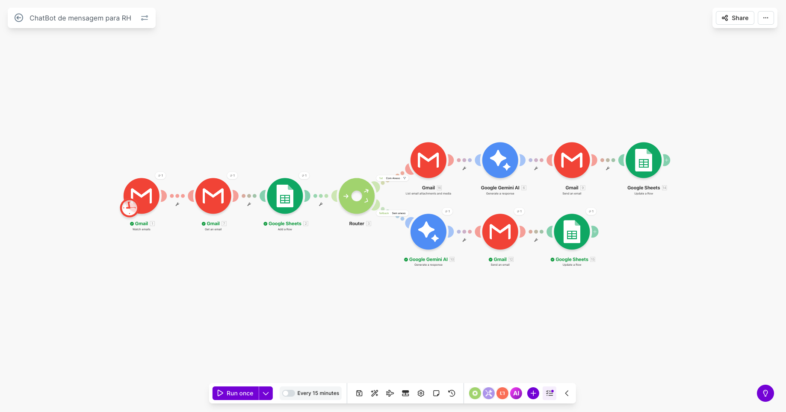

# 🤖 Assistente de IA para Automação de RH usando IA Generativa

## 📌 Descrição do Projeto

Este projeto foi desenvolvido para a disciplina **Fundamentos da IA Generativa**.

O objetivo foi criar um protótipo utilizando Inteligência Artificial Generativa capaz de automatizar tarefas repetitivas de comunicação no setor de Recursos Humanos (RH).

O sistema lê e-mails recebidos, identifica o tipo de solicitação, gera uma resposta utilizando um modelo de linguagem (LLM) e registra as informações automaticamente.

A solução foi construída utilizando ferramentas de automação, sem necessidade de programação complexa.

---

## 🎯 Problema

O setor de Recursos Humanos recebe muitos e-mails repetitivos, como:

- Envio de atestados médicos
- Solicitações de férias
- Envio de documentos
- Dúvidas de colaboradores
- Comunicados internos

Responder essas mensagens manualmente consome tempo e reduz a produtividade.

---

## 💡 Solução

Foi criada uma automação utilizando **Make.com + Gemini + Prompt Engineering**.

Fluxo:

Email → Make → Router → Gemini → Resposta → Gmail + Google Sheets

O sistema:

✔ lê os e-mails  
✔ identifica o contexto  
✔ gera uma resposta automática  
✔ envia a resposta  
✔ registra a solicitação  

---

## 🛠 Ferramentas Utilizadas

- Make.com (automação)
- Gemini (geração de respostas com LLM)
- Claude (criação de prompts e arquitetura do workflow)
- Perplexity (pesquisa e levantamento de cenários)
- NotebookLM (documentação)
- ChatGPT (roteiro do vídeo pitch)
- Gmail (entrada e saída de mensagens)
- Google Sheets (registro das solicitações)

---

## ⚙ Como Funciona

1. Um e-mail chega no Gmail
2. O cenário do Make detecta o e-mail
3. O Router separa o tipo de solicitação
4. O Gemini gera a resposta
5. A resposta é enviada automaticamente
6. Os dados são salvos no Google Sheets

---

## 🧠 Prompt Engineering

Os prompts foram elaborados para:

- manter tom formal
- gerar respostas corporativas
- adaptar ao contexto da mensagem
- evitar erros de interpretação
- padronizar a comunicação

O Claude foi utilizado como apoio na criação dos prompts e na definição da estrutura do workflow.

---

## 📂 Arquivos do Projeto

- PDF da documentação
- Prints da automação
- Imagem do workflow
- Prompts utilizados
- Vídeo pitch

---

## 🔗 Links

### 🎬 Vídeo Pitch

(link do youtube aqui)

### ⚙ Cenário no Make

(link do make aqui)

### 📄 Documentação

A documentação completa está disponível no arquivo:

[Automação de Comunicação com IA Generativa no RH](assets/automacao-rh-ia-generativa.pdf)

---

## 🖼 Workflow

---

## 🚀 Como Usar

1. Envie um e-mail para a conta configurada
2. Execute o cenário no Make
3. O sistema gera uma resposta automática
4. A resposta é enviada pelo Gmail
5. A solicitação é registrada no Google Sheets

---

## ⚠ Considerações Éticas

- A IA não deve expor dados pessoais
- É necessária supervisão humana
- As respostas devem ser revisadas em uso real
- As regras da LGPD devem ser respeitadas

---

## 👨‍🎓 Autor

Guilherme Pardin de Almeida  
Disciplina: Fundamentos da IA Generativa  
2026